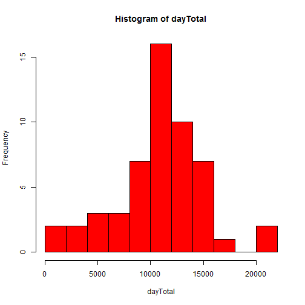
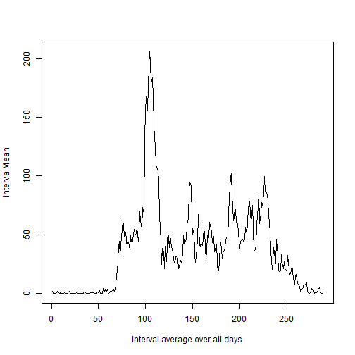
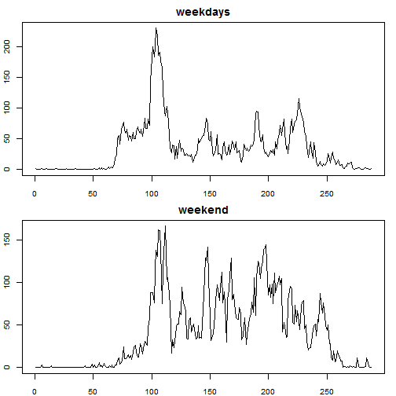

Reproducible Research / Peer Assessment 1
=========================================

## Loading and preparing Data

```r
actData = read.csv("activity.csv")
goodOnes = complete.cases(actData)
cleanData = actData[goodOnes, ]
cleanData$date = as.factor(as.character(cleanData$date))  #removing entries of date 

Sys.setlocale("LC_TIME", "English")
```

```
## [1] "English_United States.1252"
```

```r
library(chron)
```

## What is mean total number of steps taken per day?

```r
dayTotal = tapply(cleanData$steps, cleanData$date, sum, simplify = TRUE)
hist(dayTotal, breaks = 10, col = "RED")
```

 

### Mean and Median

```r
dayMean = tapply(cleanData$steps, cleanData$date, mean, simplify = TRUE)
dayMedian = tapply(cleanData$steps, cleanData$date, median, simplify = TRUE)
```


### What is the average daily activity pattern?

```r
intervalMean = tapply(cleanData$steps, cleanData$interval, mean, simplify = TRUE)
plot(intervalMean, t = "l", xlab = "Interval average over all days")
```

 


### Which 5-minute interval, on average across all the days in the dataset, contains the maximum number of steps?

```r
names(which(intervalMean == max(intervalMean)))  #name of interval with max avarage steps
```

```
## [1] "835"
```

```r
sum(!goodOnes)  #number of missing entries
```

```
## [1] 2304
```

```r

```

### Imputing missing values

```r
naIndex = which(is.na(actData$steps))
for (i in seq_along(naIndex)) {
    actData[naIndex[i], 1] = as.integer(intervalMean[as.character(actData[naIndex[i], 
        3])])
}

dayTotal2 = tapply(actData$steps, actData$date, sum, simplify = TRUE)
dayMean2 = tapply(actData$steps, actData$date, mean, simplify = TRUE)
dayMedian2 = tapply(actData$steps, actData$date, median, simplify = TRUE)
intervalMean2 = tapply(actData$steps, actData$interval, mean)
plot(intervalMean2, t = "l", xlab = "Interval average over all days")
```

 

### What is the impact of imputing missing data on the estimates of the total daily number of steps?

```r
hist(dayTotal2, breaks = 10, col = "RED")
```

 

### Are there differences in activity patterns between weekdays and weekends?

```r

actData$day = as.factor(ifelse(is.weekend(as.Date(actData$date)), "Weekend", 
    "Weekdays"))

byDays = with(actData, tapply(steps, list(day, interval), mean))

# byDays=rbind(byDays,as.integer(colnames(byDays)))

par(mfrow = c(2, 1), mar = c(2, 2, 2, 1))
plot(byDays[1, ], t = "l", main = "weekdays", ylab = "Number of steps", xlab = "Interval", 
    cex.lab = 0.7, cex.axis = 0.8)
plot(byDays[2, ], t = "l", main = "weekend", ylab = "Number of steps", xlab = "Interval", 
    cex.lab = 0.7, cex.axis = 0.8)
```

 

